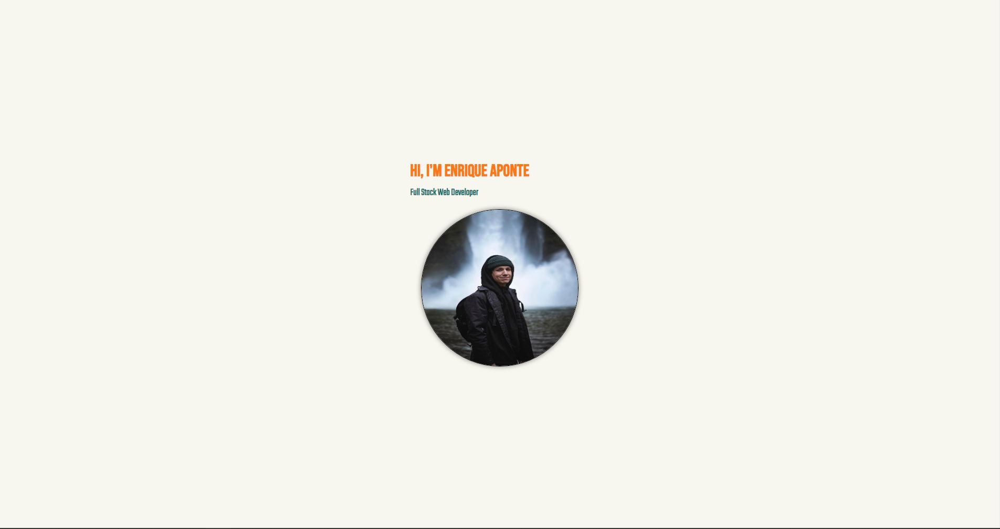
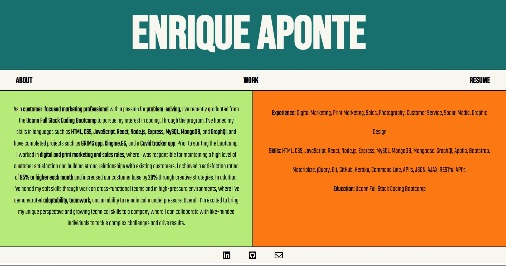
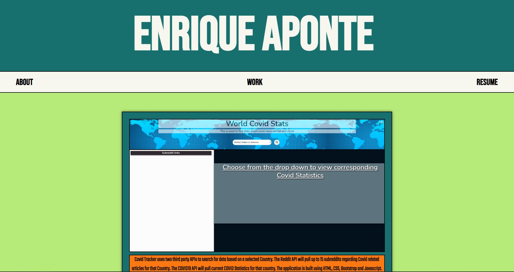
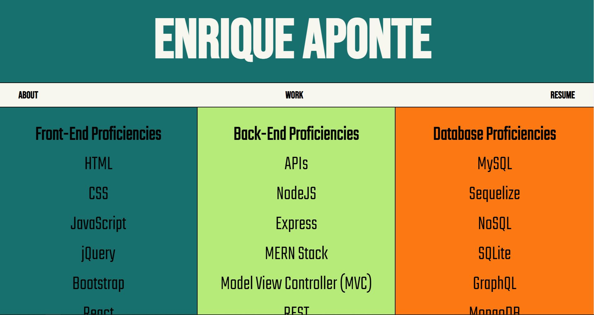

# Enrique Aponte || Personal Portfolio

## Table of Contents

- [Description](#description)
- [Usage](#usage)
    - [Landing Page](#landing-page)
    - [About Page](#about-page)
    - [Work Page](#work-page)
    - [Download Resume](#download-resume)
- [Credits](#credits)
- [License](#license)

## Description
A simple and clean portfolio built to showcase my projects and resume for future employers. As well, there is a simple way to contact or connect with me with easy to click icons at the botton of the app. You are welcomed with the about page which describes a bit about me and more skills. The app allows for an easy way to keep my current works updated with ease as well as update styling on any components.

This application is built on **React**. My portfolio is deployed on Heroku and can be accessed [here](https://eaponte24.github.io/Portfolio-2.0/).

## Usage
When you load the [portfolio](https://eaponte24.github.io/Portfolio-2.0/) you'll be greeted by a landing page where you can either click the portrait that is shown or you have 3 icons at the bottom of the page that will link you to various sites to view more of my credentials. Once you've clicked on the portrait you will be taken to the "About Page" along with other links in the nav bar in the top right. If you want to go back to the landing page then all you need to do is click the header in the top left of "Enrique Aponte”

### Landing Page
Once you access the portfolio link you will be prompted with a landing page with a slow fade in. You have a few options of either clicking the portrait to enter the portfolio or to click on any of the icons in the footer to access other sites with more credentials.
 

### About Page
Once you have clicked on the portrait in the landing page the first page you will see is the "About Page". Here you will see a short description about myself alongside a list of skills and proficiencies. Once you have access to the portfolio and the about page you will also see the nav bar in the top right with the rest of the links.
 

### Work Page
The next link would be the "Work Page" link which will direct you to my top 3 repos within my github. Within these repo cards you will see a short description along with a link to the direct github repo and the deployed link so you can test out the projects for yourself.
 

### Download Resume
When you view my "Resume Page" you will not only be able to see a list of skills that I am proficient in but you can also download my live resume in the top left corner. Once downloaded, you will be able to see a pdf version of my resume to view at your leisure.
 

## Credits
Below is a list of the packages used in this application and links to their documentation.
 
React - [https://reactjs.org/](https://reactjs.org/)
 
Styled Components - [https://styled-components.com/](https://styled-components.com/)
 
Dotenv - [https://www.npmjs.com/package/dotenv](https://www.npmjs.com/package/dotenv)
 
Axios - [https://www.npmjs.com/package/axios](https://www.npmjs.com/package/axios)
 
Pretty - [https://www.npmjs.com/package/pretty](https://www.npmjs.com/package/pretty)
 
GH-Pages - [https://www.npmjs.com/package/gh-pages](https://www.npmjs.com/package/gh-pages)
 

## License

This application is covered under the [MIT License](https://choosealicense.com/licenses/mit/).
